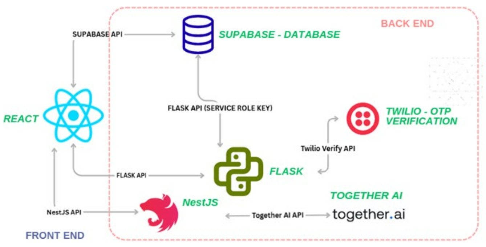
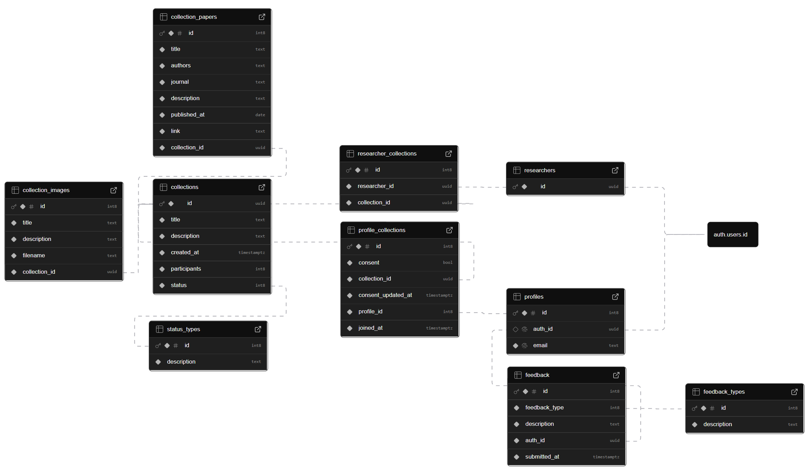

## Architecture
### Overview
The entire project was rewritten in TypeScript with type safety.

The frontend uses NextJS 16 and Shadcn UI components, while the backend uses Supabase.

### Previous Project

The previous project used to have a Flask backend for sending OTP verification in registration and password resetting via Twilio, but this is no longer required with magic links. 

The previous project also had a NestJS backend to send requests with the Together AI API for chatbot functionality, but the prompt includes the first 1000 rows of a single dataset instead of a particular research's database schema, resulting in large inputs. This occurred every time a participant asks the chatbot about the dataset, leading to high API costs. This features has not been reimplemented in the current project since it requires integration with Epsilon.

## Database Schema

`auth.users.id` is from the private user table from Supabase Authentication. The `researchers` table stores this id to identify a user as a researcher, while the `profiles` table stores this id and email for participants. Profile id is used as the primary key in case auth_id is not initialised before a user registers. 

`researcher_collections` and `profile_collections` stores the collections which the researcher and participant belongs to. Additional consent and join information is stored for participants. 

The `collections` table stores details about the research. The participants count is updated with a [trigger](https://supabase.com/dashboard/project/mvbypxdgotiqghrbzdra/database/triggers/data) when a new participant is added or an existing participant's consent is updated to false with the same collection id in the `profile_collections` table. `collection_images` details about the data visualisation, including the filename in the Supabase Storage bucket, whereas `collection_papers` stores details about the research's published papers.

`feedback` stores the feedback given by participants.

Row Level Security (RLS) is configured such that users only have select access to their collections while researchers have full access to owned collections. Only researchers have the permission to view the email and names of the collection's participants. The specific RLS policies can be viewed in the [Supabase Dashboard](https://supabase.com/dashboard/project/mvbypxdgotiqghrbzdra/auth/policies).

## Project Structure
The `/app` directory contains the code of the webpages, with the subfolders corresponding to the pathname in the application, i.e. `page.tsx` in `/dashboard` contains the code for `localhost:3000/dashboard`. Folders with square bracket names such as `[id]` are for dynamic routes. Typically, subfolders contain a single `page.tsx` file but `/app/admin/[id]` has multiple files for each tab to separate their code. The `/app/callback/page.tsx` contains the redirect routes based on the user roles after logging in. 
> [!NOTE]
> `/app/dashboard/chatbot` and `/app/dashboard/consents` do not have functionality implemented and are purely UI components.

The `/components` directory stores the base components from Shadcn in `/components/ui`, which can be edited to change the default behaviour, whereas custom shared components are stored in the root.

The `/context` directory contains `auth-context.tsx`, which is used for session management with Supabase Authentication throughout the application. The functions in this file should be updated with Keycloak equivalents for integration. The frontend should not need to be modified since all session management code is contained within this file.

The `/lib` directory includes initialising the supabase client with `supabase.ts`, database types provided to the client in `db-types.ts`, and `query.ts` containing all the database queries used throughout the application. Only this file has to be modified if using a different backend provider instead of Supabase for storage or database.

The `/hook` directory contains the `use-mobile.ts` hook for mobile responsiveness with the sidebar component

## Participant Invitation
Implemented with a Supabase (serverless) edge function since supabase admin functionality is required for sending the emails. 

The [email template](https://supabase.com/dashboard/project/mvbypxdgotiqghrbzdra/auth/templates/invite-user) is sent with the Twilio SendGrid API under these settings [here](https://supabase.com/dashboard/project/mvbypxdgotiqghrbzdra/auth/smtp).

The function takes in an array of emails and checks if they exist in the `profiles` table while also not included in `profile_collections`. Emails are first sent to participants with emails not in `profiles` to create their accounts, and all participants are then inserted into `profile_collections`. Code and details about the function can be found [here](https://supabase.com/dashboard/project/mvbypxdgotiqghrbzdra/functions/invite-participants).

## Image Uploading
> [!WARNING] 
> Supabase has a 50MB storage limit in the free tier, making it not suitable for production.

Images should ideally be uploaded in 16:9 aspect ratio to fully utilise the space in the image carousel.

Images are uploaded into a single bucket with collection id as the folder name and under the same filename stored in the `collection_images` table. 

Images can be accessed under the following format:
`<SUPABASE_URL>/storage/v1/object/public/collection_image_file/<collection_id>/<filename>`

Similar to RLS, the storage bucket is configured with policies such that only researchers that own the collection have full access while participants only have read access. The specific policies can be viewed in [Bucket Policies](https://supabase.com/dashboard/project/mvbypxdgotiqghrbzdra/storage/files/policies).

## Future Work
- Chatbot with access to the research's database schema provided by tbls
- Keycloak authentication for single sign-on